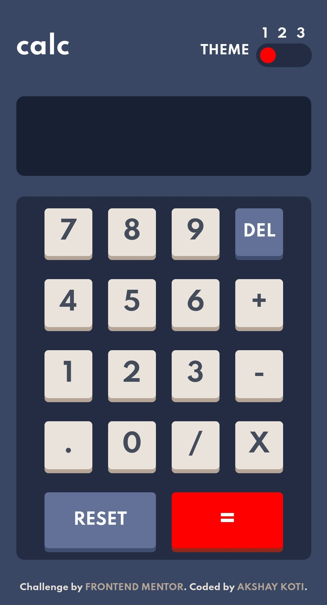
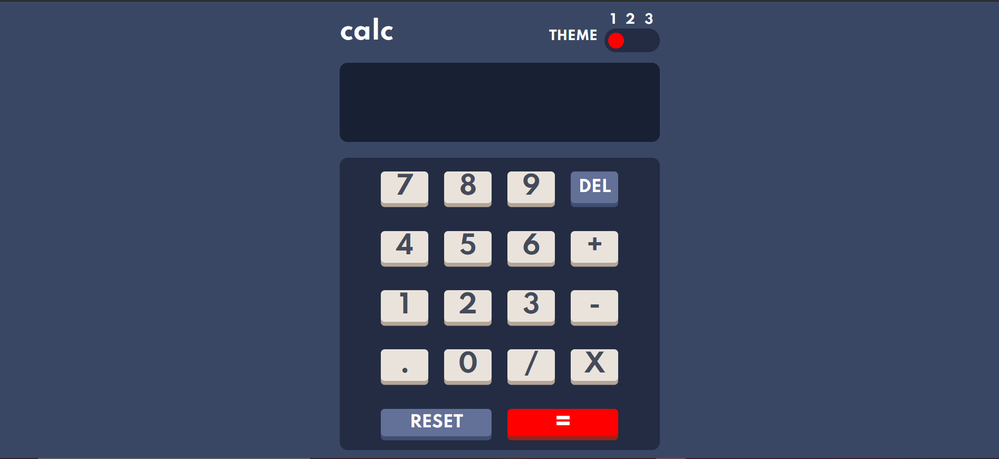

# calculator-app-akshay-koti

# Frontend Mentor - Calculator app solution

This is a solution to the [Calculator app challenge on Frontend Mentor](https://www.frontendmentor.io/challenges/calculator-app-9lteq5N29). Frontend Mentor challenges help you improve your coding skills by building realistic projects. 

## Table of contents

- [Overview](#overview)
  - [The challenge](#the-challenge)
  - [Screenshot](#screenshot)
  - [Links](#links)
- [My process](#my-process)
  - [Built with](#built-with)
  - [What I learned](#what-i-learned)
  - [Continued development](#continued-development)
  - [Useful resources](#useful-resources)
- [Author](#author)
- [Acknowledgments](#acknowledgments)

### The challenge

Users should be able to:

- See the size of the elements adjust based on their device's screen size
- Perform mathmatical operations like addition, subtraction, multiplication, and division
- Adjust the color theme based on their preference
- **Bonus**: Have their initial theme preference checked using `prefers-color-scheme` and have any additional changes saved in the browser

### Screenshot




### Links

- Solution URL: [solution GITHUB REPO](https://github.com/pitstop260/calculator-app-akshay-koti/edit/main/README.md)
- Live Site URL: [live site](https://pitstop260.github.io/calculator-app-akshay-koti/)

## My process

### Built with

- Semantic HTML5 markup
- CSS custom properties
- Flexbox
- CSS Grid
- Mobile-first workflow

### What I learned

I'am still new to JavaScript and currently learning it on udemy, This calculator app required me to make a theme toggler which was quite easy but the main struggle for me was to make the calculator itself i still haven't figured it out but for the time being i have used the ```js eval() ``` function, I will update the app once i figure out how to make the calculator without the help of ```js eval() ``` function.

### Continued development
I will update the app once i figure out how to make the calculator without the help of ```js eval() ``` function.

## Author

- Website - [AKSHAY KOTI](https://pitstop260.github.io/freecodecamp5/)
- Frontend Mentor - [@pitstop260](https://www.frontendmentor.io/profile/yourusername)
